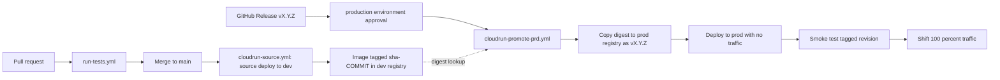

# CI/CD and Deployment Guide

This document describes the full path code takes from a developer's branch to
production, what must be done during development to keep a release possible,
how a release is promoted to production, and how to verify and roll back a
release. It is written for both developers and administrators.

## Environments

| | Development | Production |
|---|---|---|
| GCP project | `sshf-api-dev` | `sshf-api-prd` |
| Service URL | https://sshf-api-330507742215.us-central1.run.app | https://sshf-api-928260206537.us-central1.run.app |
| Cloud Run service | `sshf-api` (us-central1) | `sshf-api` (us-central1) |
| Runtime service account | `sshf-api-acc-dev@sshf-api-dev.iam.gserviceaccount.com` | `sshf-api-acc-prd@sshf-api-prd.iam.gserviceaccount.com` |
| Deploy service account | `github-service-account@sshf-api-dev.iam.gserviceaccount.com` | `github-service-account@sshf-api-prd.iam.gserviceaccount.com` |
| Image registry | `us-central1-docker.pkg.dev/sshf-api-dev/cloud-run-source-deploy/sshf-api` | `us-central1-docker.pkg.dev/sshf-api-prd/sshf-api/sshf-api` |
| Deployed by | Merge to `main` | Published GitHub Release (with approval) |
| Secrets | `sshf-api-*-dev` in dev Secret Manager | `sshf-api-*-prd` in prod Secret Manager |

Both services are publicly invokable; authentication and authorization happen
inside the application (Google OAuth + Workspace group membership).

## Pipeline overview

The core principle is **build once, promote by digest**. Production never
rebuilds from source; it receives the exact container image that was built,
deployed, and tested in dev.



Workflows involved (all in `.github/workflows/`):

| Workflow | Trigger | What it does |
|---|---|---|
| `run-tests.yml` | Pull request to `main` | Installs dependencies and runs the mocha suite |
| `cloudrun-source.yml` | PR merged to `main` | Source-deploys to dev Cloud Run (Buildpacks), then tags the built image `sha-<commit>` in the dev registry |
| `cloudrun-promote-prd.yml` | GitHub Release published (or manual dispatch) | Promotes the dev-built image digest to production |

## For developers: during development

1. Branch from `main`, make changes with tests, and open a PR. The test
   workflow must pass before merge.
2. **Never hardcode environment-specific values** (URLs, origins, client IDs).
   Runtime configuration comes from environment variables backed by Secret
   Manager. If you add a new environment variable:
   - Read it via `process.env` with a sensible local-dev fallback.
   - Document it in `env.example` and the README table.
   - Tell an administrator so the variable/secret can be added to **both** the
     dev and prod Cloud Run services before the change is released. A release
     whose code requires a variable that prod does not have will fail or
     misbehave in production.
3. Merging to `main` automatically deploys to dev. Verify your change on the
   dev service before considering it releasable.
4. The merge workflow tags the built image with the merge commit SHA. This tag
   is what makes the commit promotable to production later — if the dev deploy
   workflow failed, the release promotion for that commit will also fail, so
   keep `main` green.

## Preparing a release

1. Decide the new semver version `vX.Y.Z`:
   - **Patch** — bug fixes, no API surface change
   - **Minor** — new endpoints/fields, backward compatible
   - **Major** — breaking API changes
2. Update the version in **both** places, via a normal PR:
   - `package.json` → `"version"`
   - `swagger/swagger.js` → `info.version`
3. Merge that PR and let the dev deploy finish. The version bump commit (or
   the last commit on `main` you intend to ship) is what gets tagged.
4. Sanity-check dev: `https://sshf-api-330507742215.us-central1.run.app/openapi.json`
   should report the new version, and the app should work end to end.

## Releasing to production

1. In GitHub: **Releases → Draft a new release**. Create a new tag `vX.Y.Z`
   targeting `main` (the tag must match `v[0-9]+.[0-9]+.[0-9]+`). Write brief
   release notes and **Publish**.
2. The `Promote to Cloud Run Production` workflow starts and pauses at the
   `production` environment gate. A required reviewer (administrator) approves
   it under **Actions → the running workflow → Review deployments**.
3. After approval the workflow, running as the prod deploy service account via
   Workload Identity Federation:
   1. Resolves the dev image digest for the released commit (via the
      `sha-<commit>` tag).
   2. Copies that exact digest to the prod registry, tagged `vX.Y.Z`.
   3. Deploys it to prod Cloud Run with **no traffic** and a revision tag
      (`v1-2-3` — dots become dashes).
   4. Smoke-tests the tagged revision's private URL (`/api-docs/` must return
      success).
   5. Shifts 100% of traffic to the new revision.

If any step fails, production traffic remains on the previous revision.

### Manual promotion

The workflow can also be run by hand: **Actions → Promote to Cloud Run
Production → Run workflow**, entering an existing tag (e.g. `v1.0.0`). This is
useful for re-promoting an older version (see Rollback).

## Post-release verification

Anyone can verify; no GCP access needed for the first three:

1. **Workflow green** — the promote run shows all steps succeeded, including
   the smoke test and the traffic shift.
2. **Version arrived** — `https://sshf-api-928260206537.us-central1.run.app/openapi.json`
   reports the released version in `info.version`.
3. **App works** — open `https://sshf-api-928260206537.us-central1.run.app/api-docs/`,
   sign in with a production Google account, and exercise a protected endpoint
   (e.g. `GET /user/hasgroup`). Roles should reflect your Workspace groups.
   Note: the API caches a signed-in token's roles for 30 minutes; use a fresh
   sign-in when validating authorization changes.

Administrators can additionally confirm from the CLI:

```bash
# The serving revision and its image digest should match the release
gcloud run services describe sshf-api --region us-central1 --project sshf-api-prd \
  --format "value(status.latestReadyRevisionName, status.traffic)"

# Recent errors (should be quiet)
gcloud logging read "resource.type=cloud_run_revision AND resource.labels.service_name=sshf-api AND severity>=ERROR" \
  --project sshf-api-prd --freshness=1h --limit 20
```

## Rollback

Two options, in order of preference:

1. **Shift traffic back** (fastest, no new deploy). Cloud Run keeps previous
   revisions:

```bash
gcloud run revisions list --service sshf-api --region us-central1 --project sshf-api-prd
gcloud run services update-traffic sshf-api --region us-central1 --project sshf-api-prd \
  --to-revisions <previous-revision-name>=100
```

2. **Re-promote an older version** — run the promote workflow manually with a
   previous tag. Promoted images are retained in the prod registry under their
   version tags, and revisions are immutable, so any released version can be
   restored exactly.

## Configuration and secrets (administrators)

- Environment variable **names** are identical in dev and prod; only the
  Secret Manager secret names differ (`-dev` vs `-prd` suffix).
- The mapping of env vars to secrets lives **on the Cloud Run service**, not in
  the repository. Deploys that only change the image preserve it.

| Env var | Dev secret | Prod secret |
|---|---|---|
| `DB_URL` | `sshf-api-db-url-dev` | `sshf-api-db-url-prd` |
| `DB_NAME` | `sshf-api-db-name-dev` | `sshf-api-db-name-prd` |
| `DB_USER` | `sshf-api-db-user-dev` | `sshf-api-db-user-prd` |
| `DB_PASS` | `sshf-api-db-pass-dev` | `sshf-api-db-pass-prd` |
| `API_URL` | `sshf-api-url-dev` | `sshf-api-url-prd` |
| `GOOGLE_CLIENT_ID` | `sshf-api-auth-clientid-dev` | `sshf-api-auth-clientid-prd` |
| `ALLOWED_ORIGINS` | plain env var on the service | plain env var on the service |

- Secrets are referenced as `:latest`, but a running revision does **not**
  pick up new secret versions. After adding a secret version, force a new
  revision to apply it:

```bash
gcloud run services update sshf-api --region us-central1 --project sshf-api-prd
```

- To change `ALLOWED_ORIGINS` (for example when the production UI gets its
  custom domain):

```bash
gcloud run services update sshf-api --region us-central1 --project sshf-api-prd \
  --update-env-vars "^;^ALLOWED_ORIGINS=https://sshf-ui-824787296892.us-central1.run.app,https://sshf-api-928260206537.us-central1.run.app"
```

- **Token audience validation.** The API rejects any access token not issued
  for its OAuth client (`GOOGLE_CLIENT_ID`). The UI and Swagger currently share
  the same client ID, so no extra configuration is needed. If a separate UI
  client is ever introduced, add its ID to `ALLOWED_CLIENT_IDS`
  (comma-separated, plain env var) so both are accepted:

```bash
gcloud run services update sshf-api --region us-central1 --project sshf-api-prd \
  --update-env-vars "^;^ALLOWED_CLIENT_IDS=<api-client-id>,<ui-client-id>"
```

- **Optional email-domain lock (defense in depth).** Set `ALLOWED_EMAIL_DOMAINS`
  to reject authenticated users outside the org domain with 403:

```bash
gcloud run services update sshf-api --region us-central1 --project sshf-api-prd \
  --update-env-vars "ALLOWED_EMAIL_DOMAINS=starsandstripeshonorflight.org"
```

- **Workspace group membership (required for deployed envs).** Set
  `ALLOWED_GROUP_EMAILS` so data routes reject authenticated users who are not
  in the environment full-access group. Without this env var the group check
  is disabled. Set it in the same release window as the authorize middleware
  ships. `GET /user/hasgroup` remains auth-only for UI login probes.

```bash
# Dev
gcloud run services update sshf-api --region us-central1 --project sshf-api-dev \
  --update-env-vars "ALLOWED_GROUP_EMAILS=sshf_app_dev_full_access@starsandstripeshonorflight.org"

# Prod
gcloud run services update sshf-api --region us-central1 --project sshf-api-prd \
  --update-env-vars "ALLOWED_GROUP_EMAILS=sshf_app_prd_full_access@starsandstripeshonorflight.org"
```

## Infrastructure reference (administrators)

One-time setup that the pipeline depends on. If any of this is removed, the
promotion workflow breaks:

- **Workload Identity Federation** (per project): pool `github-pool` with OIDC
  provider `sshf-api` for `token.actions.githubusercontent.com`, restricted to
  this repository by numeric owner/repo ID. The GitHub workflows authenticate
  as the project's `github-service-account` with no stored keys.
- **Prod deploy SA roles**: `run.admin` on the prod project,
  `iam.serviceAccountUser` on the prod runtime SA, `artifactregistry.writer`
  on the prod `sshf-api` repository, and `artifactregistry.reader` on the dev
  `cloud-run-source-deploy` repository.
- **Dev deploy SA extra role**: `artifactregistry.writer` on the dev registry
  (needed for the post-deploy `sha-<commit>` tagging step).
- **Prod runtime SA**: `secretmanager.secretAccessor` on the prod project and
  the **Groups Reader** admin role in Google Workspace (Admin console → Admin
  roles). The **Admin SDK API** (`admin.googleapis.com`) must be enabled on
  the prod project or group lookups silently return no roles.
- **GitHub `production` environment**: required reviewer(s) plus the
  environment secrets `GCP_PROJECT_ID`, `GCP_SERVICE_NAME`, `GCP_REGION`,
  `GCP_WORKLOAD_IDENTITY_PROVIDER`, `GCP_SERVICE_ACCOUNT` (prod values).
  Repository-level secrets with the same names hold the dev values used by
  the merge-to-main deploy.

## Troubleshooting

| Symptom | Likely cause / fix |
|---|---|
| Promote fails: "No dev image tagged sha-…" | The released commit was never deployed to dev, or the dev deploy workflow failed before tagging. Re-run the dev deploy (or merge the commit), then re-run the promotion. |
| Promote never asks for approval | The `production` GitHub environment or its required reviewer is missing. |
| Auth step fails with a token/OIDC error | Workload Identity Federation provider, its attribute condition, or the SA binding was changed. Compare against the Infrastructure reference above. |
| Smoke test fails, traffic unchanged | The new revision does not boot or `/api-docs/` errors. Check revision logs in the prod project; production users are unaffected. Fix and release again. |
| Users authenticate but have no roles | Admin SDK API disabled in the project, runtime SA missing the Workspace Groups Reader role, or a cached token (30-minute cache — re-sign-in). With `ALLOWED_GROUP_EMAILS` set this becomes data-route `403` (fail closed). |
| Every authenticated request returns 401 after a deploy | The token audience no longer matches. `GOOGLE_CLIENT_ID` on the service must equal the OAuth client the UI/Swagger mint tokens with; if the UI uses a different client, add it to `ALLOWED_CLIENT_IDS`. |
| Some users get 403 | `ALLOWED_EMAIL_DOMAINS` rejects their verified email, or `ALLOWED_GROUP_EMAILS` is set and they are not in a listed Workspace group (or Admin SDK returned no roles). |
| New secret value not taking effect | Revisions pin secret versions at deploy time. Force a new revision (see Configuration and secrets). |
| CORS errors from the UI | The UI origin is missing from the service's `ALLOWED_ORIGINS` env var. |
