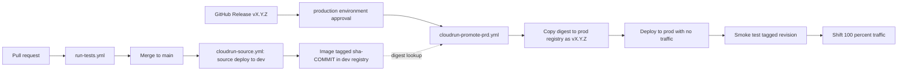

# CI/CD and Deployment Guide

This document describes the full path code takes from a developer's branch to
production, what must be done during development to keep a release possible,
how a release is promoted to production, and how to verify and roll back a
release. It is written for both developers and administrators.

## Environments

| | Development | Production |
|---|---|---|
| GCP project | `sshf-api-dev` | `sshf-api-prd` |
| Service URL | https://sshf-api-330507742215.us-central1.run.app | https://sshf-api-928260206537.us-central1.run.app |
| Cloud Run service | `sshf-api` (us-central1) | `sshf-api` (us-central1) |
| Runtime service account | `sshf-api-acc-dev@sshf-api-dev.iam.gserviceaccount.com` | `sshf-api-acc-prd@sshf-api-prd.iam.gserviceaccount.com` |
| Deploy service account | `github-service-account@sshf-api-dev.iam.gserviceaccount.com` | `github-service-account@sshf-api-prd.iam.gserviceaccount.com` |
| Image registry | `us-central1-docker.pkg.dev/sshf-api-dev/cloud-run-source-deploy/sshf-api` | `us-central1-docker.pkg.dev/sshf-api-prd/sshf-api/sshf-api` |
| Deployed by | Merge to `main` | Published GitHub Release (with approval) |
| Secrets | `sshf-api-*-dev` in dev Secret Manager | `sshf-api-*-prd` in prod Secret Manager |

Both services are publicly invokable; authentication and authorization happen
inside the application (Google OAuth + Workspace group membership).

## Pipeline overview

The core principle is **build once, promote by digest**. Production never
rebuilds from source; it receives the exact container image that was built,
deployed, and tested in dev.


```mermaid
flowchart LR
    pr[Pull request] --> tests[run-tests.yml]
    tests --> merge[Merge to main]
    merge --> devDeploy[cloudrun-source.yml: source deploy to dev]
    devDeploy --> shaTag[Image tagged sha-COMMIT in dev registry]
    release[GitHub Release vX.Y.Z] --> gate[production environment approval]
    gate --> promote[cloudrun-promote-prd.yml]
    shaTag -. digest lookup .-> promote
    promote --> copy[Copy digest to prod registry as vX.Y.Z]
    copy --> deploy[Deploy to prod with no traffic]
    deploy --> smoke[Smoke test tagged revision]
    smoke --> shift[Shift 100 percent traffic]
```

Workflows involved (all in `.github/workflows/`):

| Workflow | Trigger | What it does |
|---|---|---|
| `run-tests.yml` | Pull request to `main` | Installs dependencies and runs the mocha suite |
| `cloudrun-source.yml` | PR merged to `main` | Source-deploys to dev Cloud Run (Buildpacks), then tags the built image `sha-<commit>` in the dev registry |
| `cloudrun-promote-prd.yml` | GitHub Release published (or manual dispatch) | Promotes the dev-built image digest to production |

## For developers: during development

1. Branch from `main`, make changes with tests, and open a PR. The test
   workflow must pass before merge.
2. **Never hardcode environment-specific values** (URLs, origins, client IDs).
   Runtime configuration comes from environment variables backed by Secret
   Manager. If you add a new environment variable:
   - Read it via `process.env` with a sensible local-dev fallback.
   - Document it in `env.example` and the README table.
   - Tell an administrator so the variable/secret can be added to **both** the
     dev and prod Cloud Run services before the change is released. A release
     whose code requires a variable that prod does not have will fail or
     misbehave in production.
3. Merging to `main` automatically deploys to dev. Verify your change on the
   dev service before considering it releasable.
4. The merge workflow tags the built image with the merge commit SHA. This tag
   is what makes the commit promotable to production later — if the dev deploy
   workflow failed, the release promotion for that commit will also fail, so
   keep `main` green.

## Preparing a release

1. Decide the new semver version `vX.Y.Z`:
   - **Patch** — bug fixes, no API surface change
   - **Minor** — new endpoints/fields, backward compatible
   - **Major** — breaking API changes
2. Update the version in **both** places, via a normal PR:
   - `package.json` → `"version"`
   - `swagger/swagger.js` → `info.version`
3. Merge that PR and let the dev deploy finish. The version bump commit (or
   the last commit on `main` you intend to ship) is what gets tagged.
4. Sanity-check dev: `https://sshf-api-330507742215.us-central1.run.app/openapi.json`
   should report the new version, and the app should work end to end.

## Releasing to production

1. In GitHub: **Releases → Draft a new release**. Create a new tag `vX.Y.Z`
   targeting `main` (the tag must match `v[0-9]+.[0-9]+.[0-9]+`). Write brief
   release notes and **Publish**.
2. The `Promote to Cloud Run Production` workflow starts and pauses at the
   `production` environment gate. A required reviewer (administrator) approves
   it under **Actions → the running workflow → Review deployments**.
3. After approval the workflow, running as the prod deploy service account via
   Workload Identity Federation:
   1. Resolves the dev image digest for the released commit (via the
      `sha-<commit>` tag).
   2. Copies that exact digest to the prod registry, tagged `vX.Y.Z`.
   3. Deploys it to prod Cloud Run with **no traffic** and a revision tag
      (`v1-2-3` — dots become dashes).
   4. Smoke-tests the tagged revision's private URL (`/api-docs/` must return
      success).
   5. Shifts 100% of traffic to the new revision.

If any step fails, production traffic remains on the previous revision.

### Manual promotion

The workflow can also be run by hand: **Actions → Promote to Cloud Run
Production → Run workflow**, entering an existing tag (e.g. `v1.0.0`). This is
useful for re-promoting an older version (see Rollback).

## Post-release verification

Anyone can verify; no GCP access needed for the first three:

1. **Workflow green** — the promote run shows all steps succeeded, including
   the smoke test and the traffic shift.
2. **Version arrived** — `https://sshf-api-928260206537.us-central1.run.app/openapi.json`
   reports the released version in `info.version`.
3. **App works** — open `https://sshf-api-928260206537.us-central1.run.app/api-docs/`,
   sign in with a production Google account, and exercise a protected endpoint
   (e.g. `GET /user/permissions`). Roles should reflect your Workspace groups.
   Note: the API caches a signed-in token's roles for 15 minutes; use a fresh
   sign-in when validating authorization changes.

Administrators can additionally confirm from the CLI:

```bash
# The serving revision and its image digest should match the release
gcloud run services describe sshf-api --region us-central1 --project sshf-api-prd \
  --format "value(status.latestReadyRevisionName, status.traffic)"

# Recent errors (should be quiet)
gcloud logging read "resource.type=cloud_run_revision AND resource.labels.service_name=sshf-api AND severity>=ERROR" \
  --project sshf-api-prd --freshness=1h --limit 20
```

## Rollback

Two options, in order of preference:

1. **Shift traffic back** (fastest, no new deploy). Cloud Run keeps previous
   revisions:

```bash
gcloud run revisions list --service sshf-api --region us-central1 --project sshf-api-prd
gcloud run services update-traffic sshf-api --region us-central1 --project sshf-api-prd \
  --to-revisions <previous-revision-name>=100
```

2. **Re-promote an older version** — run the promote workflow manually with a
   previous tag. Promoted images are retained in the prod registry under their
   version tags, and revisions are immutable, so any released version can be
   restored exactly.

## Configuration and secrets (administrators)

- Environment variable **names** are identical in dev and prod; only the
  Secret Manager secret names differ (`-dev` vs `-prd` suffix).
- The mapping of env vars to secrets lives **on the Cloud Run service**, not in
  the repository. Deploys that only change the image preserve it.

| Env var | Dev secret | Prod secret |
|---|---|---|
| `DB_URL` | `sshf-api-db-url-dev` | `sshf-api-db-url-prd` |
| `DB_NAME` | `sshf-api-db-name-dev` | `sshf-api-db-name-prd` |
| `DB_USER` | `sshf-api-db-user-dev` | `sshf-api-db-user-prd` |
| `DB_PASS` | `sshf-api-db-pass-dev` | `sshf-api-db-pass-prd` |
| `API_URL` | `sshf-api-url-dev` | `sshf-api-url-prd` |
| `GOOGLE_CLIENT_ID` | `sshf-api-auth-clientid-dev` | `sshf-api-auth-clientid-prd` |
| `ALLOWED_ORIGINS` | plain env var on the service | plain env var on the service |
| `REVIEW_DB_NAME` | plain env var on the service | plain env var on the service |
| `REVIEW_DB_URL` | `sshf-api-review-db-url-dev` (if set) | `sshf-api-review-db-url-prd` (if set) |
| `REVIEW_DB_USER` | `sshf-api-review-db-user-dev` (if set) | `sshf-api-review-db-user-prd` (if set) |
| `REVIEW_DB_PASS` | `sshf-api-review-db-pass-dev` (if set) | `sshf-api-review-db-pass-prd` (if set) |
| `REVIEW_INTAKE_SERVICE_ACCOUNTS` | plain env var on the service | plain env var on the service |
| `REVIEW_INTAKE_AUDIENCE` | plain env var on the service | plain env var on the service |

- Secrets are referenced as `:latest`, but a running revision does **not**
  pick up new secret versions. After adding a secret version, force a new
  revision to apply it:

```bash
gcloud run services update sshf-api --region us-central1 --project sshf-api-prd
```

- To change `ALLOWED_ORIGINS` (for example when the production UI gets its
  custom domain):

```bash
gcloud run services update sshf-api --region us-central1 --project sshf-api-prd \
  --update-env-vars "^;^ALLOWED_ORIGINS=https://sshf-ui-824787296892.us-central1.run.app,https://sshf-api-928260206537.us-central1.run.app"
```

- **Token audience validation.** The API rejects any access token not issued
  for its OAuth client (`GOOGLE_CLIENT_ID`). The UI and Swagger currently share
  the same client ID, so no extra configuration is needed. If a separate UI
  client is ever introduced, add its ID to `ALLOWED_CLIENT_IDS`
  (comma-separated, plain env var) so both are accepted:

```bash
gcloud run services update sshf-api --region us-central1 --project sshf-api-prd \
  --update-env-vars "^;^ALLOWED_CLIENT_IDS=<api-client-id>,<ui-client-id>"
```

- **Optional email-domain lock (defense in depth).** Production does **not**
  require `ALLOWED_EMAIL_DOMAINS`. Authorization on Cloud Run is audience
  validation plus Workspace group membership. Set `ALLOWED_EMAIL_DOMAINS` only
  as an extra check: when the list is set, unverified emails and addresses
  outside those domains are rejected with 403. Leave it unset to skip the
  domain check.

```bash
gcloud run services update sshf-api --region us-central1 --project sshf-api-prd \
  --update-env-vars "ALLOWED_EMAIL_DOMAINS=starsandstripeshonorflight.org"
```

- **Workspace role groups (FULL required on Cloud Run).** Five roles map
  from comma-separated env vars. Group emails are not secrets. On Cloud Run
  (`K_SERVICE` set) the process exits at startup when `AUTHZ_ROLE_FULL_GROUPS`
  is empty, when an `AUTHZ_ROLE_*_GROUPS` name is not one of READ, WRITE,
  FULL, MEDICAL, or REVIEW, when a value is not an email, or when Directory
  cannot find a configured group (`groups.get`, 3 attempts, about 15 seconds).
  A Directory outage at startup also exits, so the new revision does not take
  traffic. Local runs without `K_SERVICE` log warnings and continue.
  `AUTHZ_ROLE_FULL_GROUPS` is the only FULL source. `ALLOWED_GROUP_EMAILS` is
  ignored; remove it from the service after this revision is serving.

  Protected routes require the permission declared for that method and path
  (`records:read`, `exports:read`, `records:write`, `records:delete`,
  `documents:admin`, `flights:manage`, `applications:review`,
  `applications:accept`). WRITE includes READ. FULL includes WRITE. FULL does
  not include MEDICAL or REVIEW. MEDICAL has no endpoints yet, so a
  medical-only user is denied on every current route. `GET /user/permissions`
  is auth-only and returns roles plus the effective permission union
  (`Cache-Control: no-store`).
  `AUTHZ_DEV_OVERRIDE_ROLES` is a local-only override (no `K_SERVICE`). A
  comma-separated list of role ids, for example `FULL,REVIEW`, skips Directory
  membership after the token is accepted and projects those roles onto
  `GET /user/permissions` and `requirePermission`. Inheritance is unchanged.
  Never set it on Cloud Run: startup fails if `K_SERVICE` is set and the
  variable is non-empty, and deployed revisions do not honor it.

  | Env var | Role | Dev group | Prod group |
  |---|---|---|---|
  | `AUTHZ_ROLE_READ_GROUPS` | READ | `sshf_app_dev_read_access@starsandstripeshonorflight.org` | `sshf_app_prd_read_access@starsandstripeshonorflight.org` |
  | `AUTHZ_ROLE_WRITE_GROUPS` | WRITE | `sshf_app_dev_write_access@starsandstripeshonorflight.org` | `sshf_app_prd_write_access@starsandstripeshonorflight.org` |
  | `AUTHZ_ROLE_FULL_GROUPS` | FULL | `sshf_app_dev_full_access@starsandstripeshonorflight.org` | `sshf_app_prd_full_access@starsandstripeshonorflight.org` |
  | `AUTHZ_ROLE_MEDICAL_GROUPS` | MEDICAL | `sshf_app_dev_medical_access@starsandstripeshonorflight.org` | `sshf_app_prd_medical_access@starsandstripeshonorflight.org` |
  | `AUTHZ_ROLE_REVIEW_GROUPS` | REVIEW | `sshf_app_dev_review_access@starsandstripeshonorflight.org` | `sshf_app_prd_review_access@starsandstripeshonorflight.org` |

  WRITE includes every READ permission. FULL includes every WRITE permission.
  FULL does not include MEDICAL or REVIEW.

  Membership in a configured role group includes nested groups. Admin SDK
  `members.hasMember` is true when the user is a direct member or a member of
  a group that belongs to that role group. The API does not call `groups.list`.
  Startup still calls `groups.get`, so the existing Groups Reader role and
  `admin.directory.group.readonly` scope stay in place. Do not narrow that
  scope in this change. A follow-up could switch the startup check to
  `members.list` and then evaluate `admin.directory.group.member.readonly`.
  Positive membership is cached for up to 15 minutes, a negative result for
  about 2 minutes, and Directory errors are not cached. After changing group
  membership, allow a few minutes for Google to propagate and then sign in
  again. Only domain admins should own these authorization groups and every
  group nested inside them.

```bash
# Dev (prod uses the sshf_app_prd_* groups on sshf-api-prd)
gcloud run services update sshf-api --region us-central1 --project sshf-api-dev \
  --update-env-vars "^;^AUTHZ_ROLE_READ_GROUPS=sshf_app_dev_read_access@starsandstripeshonorflight.org;AUTHZ_ROLE_WRITE_GROUPS=sshf_app_dev_write_access@starsandstripeshonorflight.org;AUTHZ_ROLE_FULL_GROUPS=sshf_app_dev_full_access@starsandstripeshonorflight.org;AUTHZ_ROLE_MEDICAL_GROUPS=sshf_app_dev_medical_access@starsandstripeshonorflight.org;AUTHZ_ROLE_REVIEW_GROUPS=sshf_app_dev_review_access@starsandstripeshonorflight.org"
```

  After `AUTHZ_ROLE_FULL_GROUPS` is set on the serving revision, delete the
  old variable. It is ignored and does not grant FULL:

```bash
# Dev, then prod (sshf-api-prd)
gcloud run services update sshf-api --region us-central1 --project sshf-api-dev \
  --remove-env-vars ALLOWED_GROUP_EMAILS
```

  **Phase 3 rollout (dev first, then prod).** Do this before the revision that
  enforces per-route permissions takes traffic:

  1. Add current application reviewers to `*_review_access`. Nest the BoD
     group in `*_write_access` if that is the intended WRITE path, and add
     any read-only users to `*_read_access`. Leave everyone in `*_full_access`
     until the UI no longer depends on that group.
  2. Deploy. Check `GET /user/permissions` for a READ-only user, a WRITE-only
     user, a REVIEW user, and a FULL user.
  3. The UI migration (sshf-ui #234) is in production. Remove most board
     members from `*_full_access` when you are ready. They keep WRITE through
     the nested BoD group. A few people stay in FULL.

  If step 1 is skipped, a FULL user who reviews applications loses review
  access at deploy time, because FULL does not include REVIEW. Adding them
  to `*_review_access` restores it within the cache TTL (about 2 minutes
  for a new grant).

## Infrastructure reference (administrators)

One-time setup that the pipeline depends on. If any of this is removed, the
promotion workflow breaks:

- **Workload Identity Federation** (per project): pool `github-pool` with OIDC
  provider `sshf-api` for `token.actions.githubusercontent.com`, restricted to
  this repository by numeric owner/repo ID. The GitHub workflows authenticate
  as the project's `github-service-account` with no stored keys.
- **Prod deploy SA roles**: `run.admin` on the prod project,
  `iam.serviceAccountUser` on the prod runtime SA, `artifactregistry.writer`
  on the prod `sshf-api` repository, and `artifactregistry.reader` on the dev
  `cloud-run-source-deploy` repository.
- **Dev deploy SA extra role**: `artifactregistry.writer` on the dev registry
  (needed for the post-deploy `sha-<commit>` tagging step).
- **Prod runtime SA**: `secretmanager.secretAccessor` on the prod project and
  the **Groups Reader** admin role in Google Workspace (Admin console → Admin
  roles). The **Admin SDK API** (`admin.googleapis.com`) must be enabled on
  the prod project. A Directory lookup failure returns `503` from
  authentication instead of an empty role list.
- **GitHub `production` environment**: required reviewer(s) plus the
  environment secrets `GCP_PROJECT_ID`, `GCP_SERVICE_NAME`, `GCP_REGION`,
  `GCP_WORKLOAD_IDENTITY_PROVIDER`, `GCP_SERVICE_ACCOUNT` (prod values).
  Repository-level secrets with the same names hold the dev values used by
  the merge-to-main deploy.

## Troubleshooting

| Symptom | Likely cause / fix |
|---|---|
| Promote fails: "No dev image tagged sha-…" | The released commit was never deployed to dev, or the dev deploy workflow failed before tagging. Re-run the dev deploy (or merge the commit), then re-run the promotion. |
| Promote never asks for approval | The `production` GitHub environment or its required reviewer is missing. |
| Auth step fails with a token/OIDC error | Workload Identity Federation provider, its attribute condition, or the SA binding was changed. Compare against the Infrastructure reference above. |
| Smoke test fails, traffic unchanged | The new revision does not boot or `/api-docs/` errors. Check revision logs in the prod project; production users are unaffected. Fix and release again. |
| Users authenticate but have no roles | Successful Directory lookup returned no groups, or a cached token (15-minute cache — re-sign-in). When role groups are configured, a user in none of them gets data-route `403` `{ message: "Forbidden: Account not permitted" }`. A user in READ, WRITE, FULL, or REVIEW can call the routes those roles grant. MEDICAL alone is `403` on every current route. On Cloud Run an Admin SDK outage returns `503` from authentication instead of that empty role list. Off Cloud Run a failed lookup continues with no roles so local API testing can reach CouchDB when no role groups are set. |
| Every authenticated request returns 401 after a deploy | The token audience no longer matches. `GOOGLE_CLIENT_ID` on the service must equal the OAuth client the UI/Swagger mint tokens with; if the UI uses a different client, add it to `ALLOWED_CLIENT_IDS`. |
| Revision fails to start, or every data route returns 403 | On Cloud Run, FULL is missing or empty, a role variable name is unknown, a group email is malformed, or Directory could not confirm a configured group (404 or an outage after retries). Set `AUTHZ_ROLE_FULL_GROUPS` to a group that exists and deploy a new revision. `ALLOWED_GROUP_EMAILS` is ignored and does not satisfy FULL. Local runs without `K_SERVICE` warn and continue. |
| Some users get 403 | `ALLOWED_EMAIL_DOMAINS` is set and rejects an unverified or out-of-domain email (`Forbidden: Account not permitted`), the user holds no role, or the user lacks that route's permission. The missing-permission body keeps `message` and adds `requiredPermission` (for example `records:delete` or `applications:review`). FULL does not include review or medical. A Directory outage is `503`, not this `403`. |
| Nested member is denied, or a removed member still has access | Every configured role group is checked with `members.hasMember` (direct and nested). A misspelled or deleted group is treated as not a member and logged against its `AUTHZ_ROLE_*_GROUPS` variable. Startup on Cloud Run fails if the group is already missing. Negative results refresh in about 2 minutes; granted membership can linger up to 15 minutes. Allow a few minutes for Google to propagate, then sign in again. A Directory outage is still `503` on Cloud Run. |
| New secret value not taking effect | Revisions pin secret versions at deploy time. Force a new revision (see Configuration and secrets). |
| CORS errors from the UI | The UI origin is missing from the service's `ALLOWED_ORIGINS` env var. |
